# Поиск аномалий в банковских транзакциях
Необходимо настроить систему распознавания мошеннических транзакций по кредитным картам, чтобы с клиентов не взималась плата за товары, которые они не покупали. Исходные данные анонимных транзакций по кредитным картам на https://www.kaggle.com/mlg-ulb/creditcardfraud#creditcard.csv.

## Подключение библиотек
```python
# Импорт основных библиотек
import numpy as np
import pandas as pd

# Импорт библиотек машинного обучения
from sklearn.preprocessing import MinMaxScaler
from sklearn.model_selection import train_test_split
from sklearn.cluster import DBSCAN
from sklearn.svm import OneClassSVM
from sklearn.ensemble import IsolationForest
from sklearn.metrics import confusion_matrix, precision_score, recall_score, f1_score, roc_auc_score
from sklearn.decomposition import PCA
from sklearn.manifold import TSNE
from umap import UMAP

# Импорт библиотеки построения диаграмм и графиков
from matplotlib import pyplot as plt
import seaborn as sns

# Указание режима отображения диаграмм
%matplotlib inline

# Настройка среды Pandas
pd.set_option("display.max_columns", 200)

# Для воспроизводимости зафиксируем начальное значение генератора случайных чисел
np.random.seed(42)

# Число отображаемых признаков в матрице рассеивания
NUM_FEATURES = 8
```
## Загрузка исходных данных
```python
# Загрузка исходных данных по банковским транзакциям
transaction_df = pd.read_csv('creditcard.csv')

# Вывод загруженных данных
transaction_df.head()
```
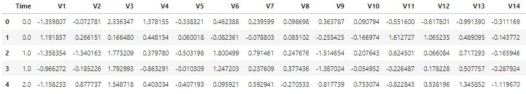

```python
# Указание удобных наименований признаков
transaction_df.columns = transaction_df.columns.str.lower()
```

## Разведочный анализ
```python
# Сводная информация о структуре исходных данных
transaction_df.info()
```
```
<class 'pandas.core.frame.DataFrame'>
RangeIndex: 284807 entries, 0 to 284806
Data columns (total 31 columns):
 #   Column  Non-Null Count   Dtype  
---  ------  --------------   -----  
 0   time    284807 non-null  float64
 1   v1      284807 non-null  float64
 2   v2      284807 non-null  float64
 3   v3      284807 non-null  float64
 4   v4      284807 non-null  float64
 5   v5      284807 non-null  float64
 6   v6      284807 non-null  float64
 7   v7      284807 non-null  float64
 8   v8      284807 non-null  float64
 9   v9      284807 non-null  float64
 10  v10     284807 non-null  float64
 11  v11     284807 non-null  float64
 12  v12     284807 non-null  float64
 13  v13     284807 non-null  float64
 14  v14     284807 non-null  float64
 15  v15     284807 non-null  float64
 16  v16     284807 non-null  float64
 17  v17     284807 non-null  float64
 18  v18     284807 non-null  float64
 19  v19     284807 non-null  float64
 20  v20     284807 non-null  float64
 21  v21     284807 non-null  float64
 22  v22     284807 non-null  float64
 23  v23     284807 non-null  float64
 24  v24     284807 non-null  float64
 25  v25     284807 non-null  float64
 26  v26     284807 non-null  float64
 27  v27     284807 non-null  float64
 28  v28     284807 non-null  float64
 29  amount  284807 non-null  float64
 30  class   284807 non-null  int64  
dtypes: float64(30), int64(1)
memory usage: 67.4 MB
```

```python
# Вывод основных статистик
transaction_df.describe()
```
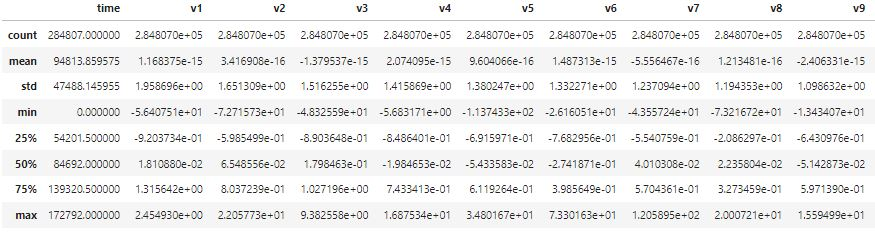

```python
# Определение основных объектов диаграмм
fig, axes = plt.subplots(8, 4, figsize=(20, 30))

# Построение гистограмм признаков
for ax, column in zip(axes.flat, transaction_df.columns):
    sns.histplot(transaction_df.sample(n=1000, random_state=42)[column], ax=ax)

# Вывод диаграммы
plt.show()
```
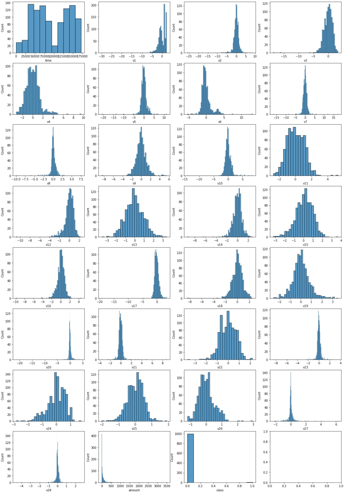

Используя матрицу корреляции оценим сильные и слабые связи между признаками. Проанализируем сильные и слабые признаки по отдельности.

```python
# Создание цветовой карты для подсвечивания сильных связей
color_map = sns.color_palette(['#d7301f', '#fcae91', '#f7f7f7', '#f7f7f7', '#f7f7f7', '#f7f7f7', '#9ecae1', '#08519c'])

# Определение размера диаграммы
plt.figure(figsize=(18, 14))

# Вывод матрицы корреляции для оценки степени линейной зависимости между признаками
sns.heatmap(
    transaction_df.corr(), cmap=color_map, square=True, vmin=-1, vmax=1, center= 0, annot=True,
    linewidths=0.1, fmt='.1f', cbar_kws=dict(ticks=np.arange(-1.0, 1.1, 0.25), aspect=30)
)

# Вывод диаграммы
plt.show()
```
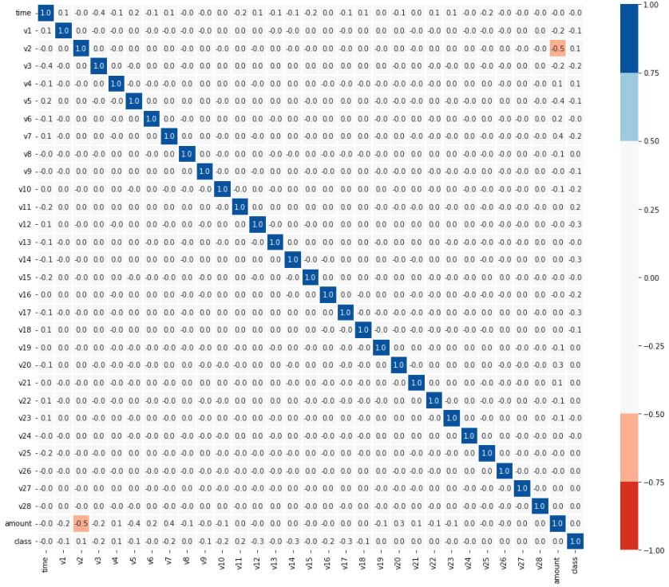

Для признаков с сильными связями выведем парное отношение и их распределение.

```python
# Формирование списка признаков с сильными связями
corr_matrix = np.abs(transaction_df.corr())
strong_features = [column for column in corr_matrix.columns if any((corr_matrix[column] > 0.5) & (corr_matrix[column] < 1))]

# Отображение парных отношений признаков и их распределение
sns.pairplot(transaction_df.sample(n=1000, random_state=42)[strong_features], diag_kind='hist')

# Вывод диаграммы
plt.show()
```
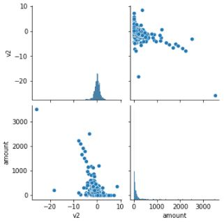

Для признаков со слабыми связями матрицу рассеивания отобразим только для небольшой части, поскольку процесс построения парных отношений признаков и их распределений ресурсоемкий.

```python
# Формирование списка признаков со слабыми связями
other_features = corr_matrix[~corr_matrix.columns.isin(strong_features)].columns[:-1]

# Отображение парных отношений признаков и их распределение
sns.pairplot(transaction_df.sample(n=5000)[other_features[:NUM_FEATURES]], diag_kind='hist', height=2)

# Вывод диаграммы
plt.show()
```
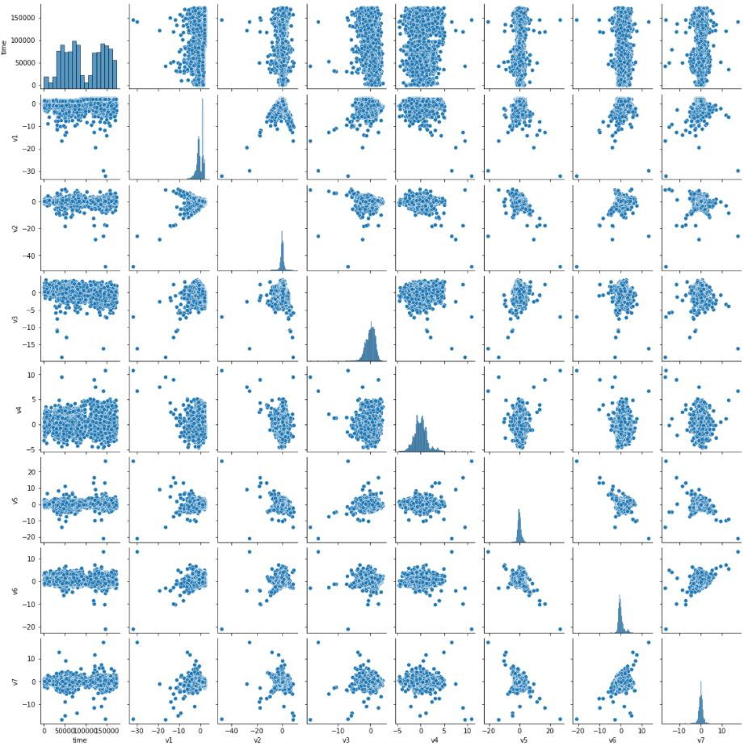

## Предобработка данных
Приведем признаки к одному масштабу, поскольку не все алгоритмы машинного обучения могут хорошо работать с данными из разного диапазона. Выполним масштабирование признаков в диапазоне от 0 до 1.
```python
# Нормализация значений признаков
X_data = MinMaxScaler().fit_transform(transaction_df.iloc[:, :-1])
Y_data = transaction_df.iloc[:, -1]
```

## Построение моделей
Поскольку количество наблюдений в исходных данных более 200 тысяч, для моделирования и поиска выбросов возьмем только их малую часть. Предполагаем, что полученная случайная выборка является репрезентативной выборкой для исходных данных.
```python
# Формирование стратифицированной выборки из исходных данных
X_samples, _, Y_samples, _ = train_test_split(X_data, Y_data, train_size=0.02, stratify=Y_data, random_state=42)

# Вывод доли аномалий от общего числа транзакций
print('Процент аномальных транзакций: {:.2%}'.format(Y_data.mean()))
print('Процент аномальных транзакций в выборке: {:.2%}'.format(Y_samples.mean()))
```
```
Процент аномальных транзакций: 0.17%
Процент аномальных транзакций в выборке: 0.18%
```

### Правило 3-х сигм
```python
# Формирование матрицы выбросов
sigma_outliers = []
for i in range(3, 6):
    up_bound = X_samples.mean(axis=0) + i * X_samples.std(axis=0)
    low_bound = X_samples.mean(axis=0) - i * X_samples.std(axis=0)
    sigma_outliers.append(np.where((X_samples < low_bound) | (X_samples > up_bound), 1, 0).any(axis=1).astype('int8'))

# Подсчет количества и процента выбросов для разных сигм
sum_list = np.array(sigma_outliers).sum(axis=1)
mean_list = np.array(sigma_outliers).mean(axis=1)

# Сохраняем значения для сигмы с наименьшим процентом выбросов
sigma_outliers = np.array(sigma_outliers)[sum_list.argmin()]
    
# Вывод информации по аномальным транзакциям и выбросам
print('Процент аномальных транзакций в выборке: {:.2%}'.format(Y_samples.mean()))
print('-----------------------------------------------')
print('Количество выбросов в выборке для {} сигм: {}'.format(sum_list.argmin() + 3, sum_list.min()))
print('Процент выбросов в выборке для {} сигм: {:.2%}'.format(mean_list.argmin() + 3, mean_list.min()))
```
```
Процент аномальных транзакций в выборке: 0.18%
-----------------------------------------------
Количество выбросов в выборке для 5 сигм: 191
Процент выбросов в выборке для 5 сигм: 3.35%
```

```python
# Формирование матрицы транзакций с атрибутом выброса
tr_matrix = np.hstack((X_samples[:, :NUM_FEATURES], sigma_outliers[:, None]))
tr_df = pd.DataFrame(tr_matrix, columns=[*transaction_df.columns[:NUM_FEATURES], 'outliers'])

# Отображение парных отношений признаков и их распределение
sns.pairplot(tr_df, hue='outliers', hue_order=[1, 0], height=2)

# Вывод диаграммы
plt.show()
```
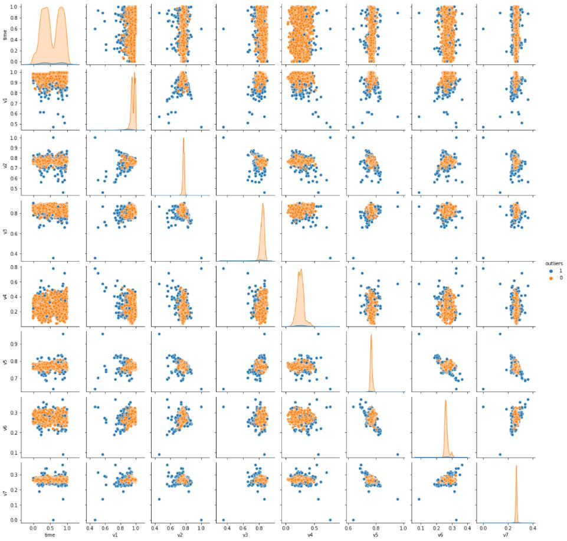

### Межквартильное отклонение
```python
# Формирование матрицы выбросов
quantile_outliers = []
for i in range(3, 11):
    up_bound, low_bound = np.quantile(X_samples, [0.75, 0.25], axis=0)
    up_bound, low_bound = [up_bound, low_bound] + np.array([[i], [-i]]) * (up_bound - low_bound)
    quantile_outliers.append(np.where((X_samples < low_bound) | (X_samples > up_bound), 1, 0).any(axis=1).astype('int8'))

# Подсчет количества и процента выбросов для разного межквартильного расстояния
sum_list = np.array(quantile_outliers).sum(axis=1)
mean_list = np.array(quantile_outliers).mean(axis=1)

# Сохраняем значения для межквартильного расстояния с наименьшим процентом выбросов
quantile_outliers = np.array(quantile_outliers)[sum_list.argmin()]

# Вывод информации по аномальным транзакциям и выбросам
print('Процент аномальных транзакций в выборке: {:.2%}'.format(Y_samples.mean()))
print('-----------------------------------------------')
print('Количество выбросов в выборке для {} IRQ: {}'.format(sum_list.argmin() + 3, sum_list.min()))
print('Процент выбросов в выборке для {} IRQ: {:.2%}'.format(mean_list.argmin() + 3, mean_list.min()))
```
```
Процент аномальных транзакций в выборке: 0.18%
-----------------------------------------------
Количество выбросов в выборке для 10 IRQ: 224
Процент выбросов в выборке для 10 IRQ: 3.93%
```

```python
# Формирование матрицы транзакций с атрибутом выброса
tr_matrix = np.hstack((X_samples[:, :NUM_FEATURES], quantile_outliers[:, None]))
tr_df = pd.DataFrame(tr_matrix, columns=[*transaction_df.columns[:NUM_FEATURES], 'outliers'])

# Отображение парных отношений признаков и их распределение
sns.pairplot(tr_df, hue='outliers', hue_order=[1, 0], height=2)

# Вывод диаграммы
plt.show()
```
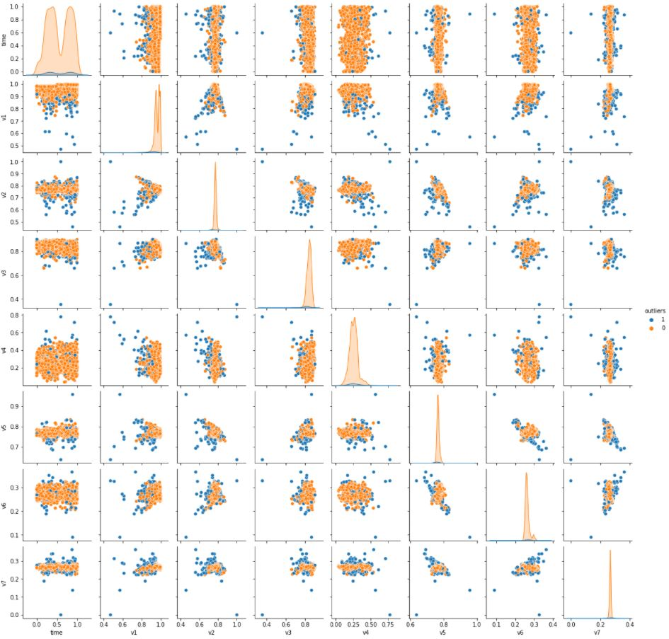

### Метод DBSCAN
```python
# Определение переменных
num_clusters = []
per_anomalies = []

# Построение модели для поиска оптимального значения окрестности EPS
for i in np.arange(0.05, 0.5, 0.05):
    model = DBSCAN(eps=i, n_jobs=-1).fit(X_samples)
    num_clusters.append(len(np.unique(model.labels_)) - 1)
    per_anomalies.append(np.where(model.labels_==-1, 1, 0).sum() / len(model.labels_))
    
# Определение основных объектов диаграмм
fig, axes = plt.subplots(1, 1, figsize=(7,4))

# Построение графика зависимости процента выбросов от количества кластеров
sns.lineplot(x=np.arange(0.05, 0.5, 0.05), y=num_clusters, marker='o', ax=axes, color='tab:red')
percent_axes = sns.lineplot(x=np.arange(0.05, 0.5, 0.05), y=per_anomalies, marker='o', ax=axes.twinx(), color='tab:blue')

# Вывод заголовка диаграмм и подписей осей
axes.set(title='График оптимального значения окрестности EPS', xlabel='EPS (окрестность)')
axes.set_ylabel('Количество кластеров', color='tab:red')
axes.tick_params(axis='y', labelcolor='tab:red')
percent_axes.set_ylabel('Процент выбросов', color='tab:blue')
percent_axes.tick_params(axis='y', labelcolor='tab:blue')

# Вывод диаграмм
plt.show()
```
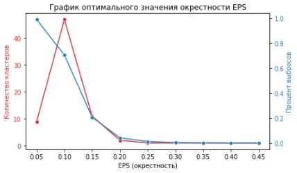

```python
# Формирование матрицы выбросов
model = DBSCAN(eps=0.3, n_jobs=-1).fit(X_samples)
dbscan_outliers = np.where(model.labels_==-1, 1, 0)

# Вывод информации по аномальным транзакциям и выбросам
print('Процент аномальных транзакций в выборке: {:.2%}'.format(Y_samples.mean()))
print('-----------------------------------------------')
print('Количество выбросов в выборке: {}'.format(dbscan_outliers.sum()))
print('Процент выбросов в выборке: {:.2%}'.format(dbscan_outliers.mean()))
```
```
Процент аномальных транзакций в выборке: 0.18%
-----------------------------------------------
Количество выбросов в выборке: 25
Процент выбросов в выборке: 0.44%
```

```python
# Формирование матрицы транзакций с атрибутом выброса
tr_matrix = np.hstack((X_samples[:, :NUM_FEATURES], dbscan_outliers[:, None]))
tr_df = pd.DataFrame(tr_matrix, columns=[*transaction_df.columns[:NUM_FEATURES], 'outliers'])

# Отображение парных отношений признаков и их распределение
sns.pairplot(tr_df, hue='outliers', hue_order=[1, 0], height=2)

# Вывод диаграммы
plt.show()
```
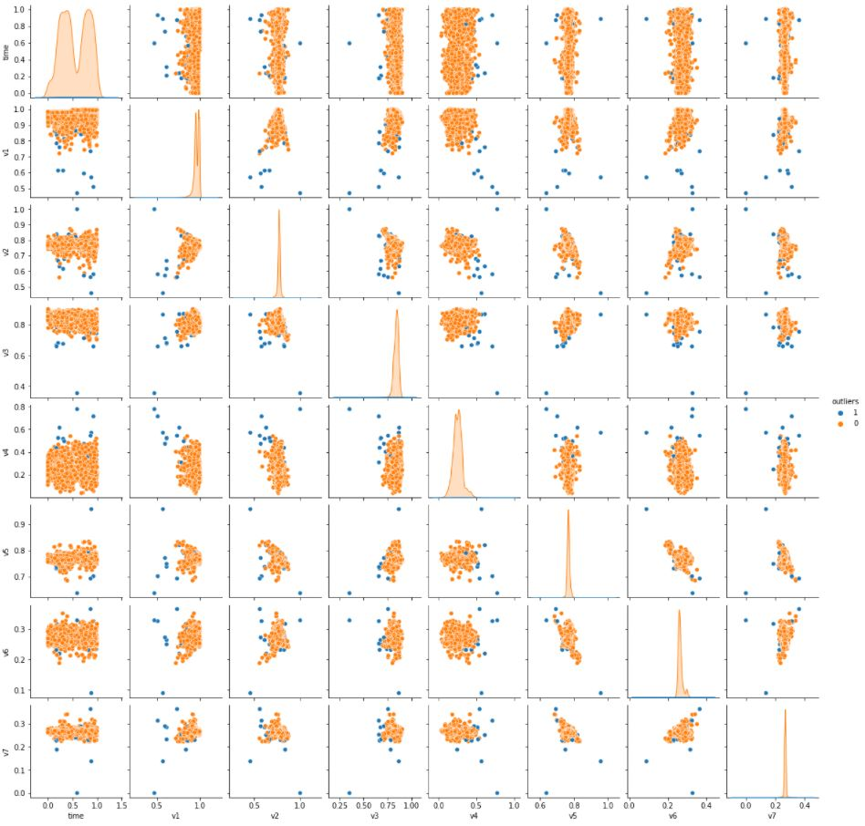

### Метод One-Class SVM
```python
# Формирование матрицы выбросов
svm_outliers = []
for i in np.arange(0.01, 0.1, 0.02):
    model = OneClassSVM(nu=i, gamma='auto').fit(X_samples)
    svm_outliers.append(np.where(model.predict(X_samples)==-1, 1, 0))

# Подсчет количества и процента выбросов для разных моделей
sum_list = np.array(svm_outliers).sum(axis=1)
mean_list = np.array(svm_outliers).mean(axis=1)

# Сохраняем значения для модели с наименьшим процентом выбросов
svm_outliers = np.array(svm_outliers)[sum_list.argmin()]

# Вывод информации по аномальным транзакциям и выбросам
print('Процент аномальных транзакций в выборке: {:.2%}'.format(Y_samples.mean()))
print('-----------------------------------------------')
print('Количество выбросов в выборке: {}'.format(sum_list.min()))
print('Процент выбросов в выборке: {:.2%}'.format(mean_list.min()))
```
```
Процент аномальных транзакций в выборке: 0.18%
-----------------------------------------------
Количество выбросов в выборке: 55
Процент выбросов в выборке: 0.97%
```

```python
# Формирование матрицы транзакций с атрибутом выброса
tr_matrix = np.hstack((X_samples[:, :NUM_FEATURES], svm_outliers[:, None]))
tr_df = pd.DataFrame(tr_matrix, columns=[*transaction_df.columns[:NUM_FEATURES], 'outliers'])

# Отображение парных отношений признаков и их распределение
sns.pairplot(tr_df, hue='outliers', hue_order=[1, 0], height=2)

# Вывод диаграммы
plt.show()
```
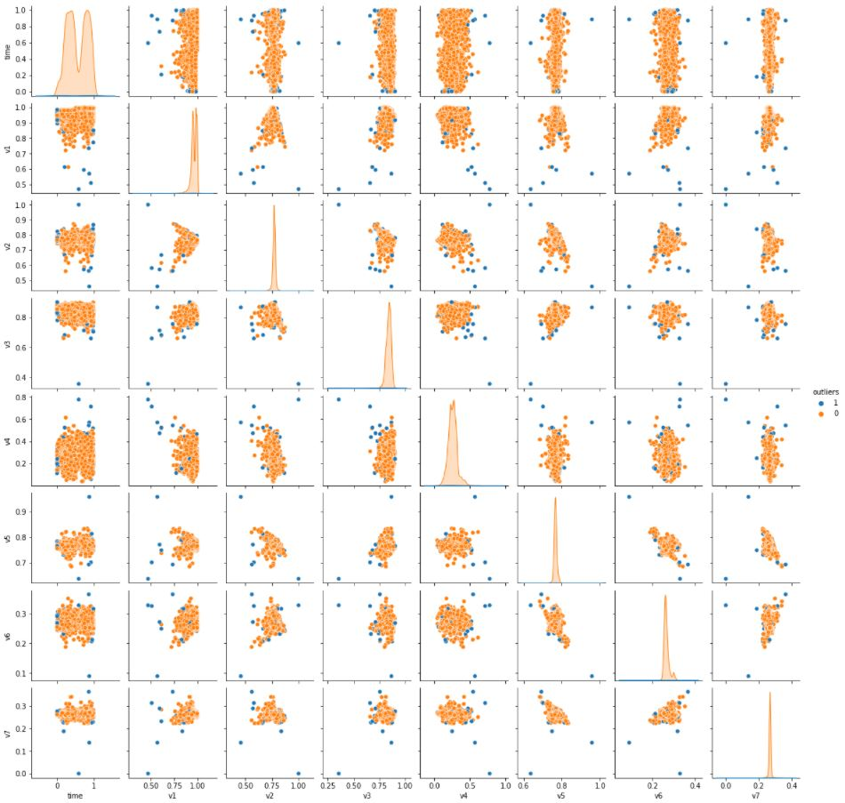

### Метод Isolation Forest
```python
# Формирование матрицы выбросов
forest_outliers = []
for i in np.arange(0.005, 0.05, 0.005):
    model = IsolationForest(n_jobs=-1, contamination=i, random_state=42).fit(X_samples)
    forest_outliers.append(np.where(model.predict(X_samples)==-1, 1, 0))

# Подсчет количества и процента выбросов для разных моделей
sum_list = np.array(forest_outliers).sum(axis=1)
mean_list = np.array(forest_outliers).mean(axis=1)

# Сохраняем значения для модели с наименьшим процентом выбросов
forest_outliers = np.array(forest_outliers)[sum_list.argmin()]

# Вывод информации по аномальным транзакциям и выбросам
print('Процент аномальных транзакций в выборке: {:.2%}'.format(Y_samples.mean()))
print('-----------------------------------------------')
print('Количество выбросов в выборке: {}'.format(sum_list.min()))
print('Процент выбросов в выборке: {:.2%}'.format(mean_list.min()))
```
```
Процент аномальных транзакций в выборке: 0.18%
-----------------------------------------------
Количество выбросов в выборке: 29
Процент выбросов в выборке: 0.51%
```

```python
# Формирование матрицы транзакций с атрибутом выброса
tr_matrix = np.hstack((X_samples[:, :NUM_FEATURES], forest_outliers[:, None]))
tr_df = pd.DataFrame(tr_matrix, columns=[*transaction_df.columns[:NUM_FEATURES], 'outliers'])

# Отображение парных отношений признаков и их распределение
sns.pairplot(tr_df, hue='outliers', hue_order=[1, 0], height=2)

# Вывод диаграммы
plt.show()
```
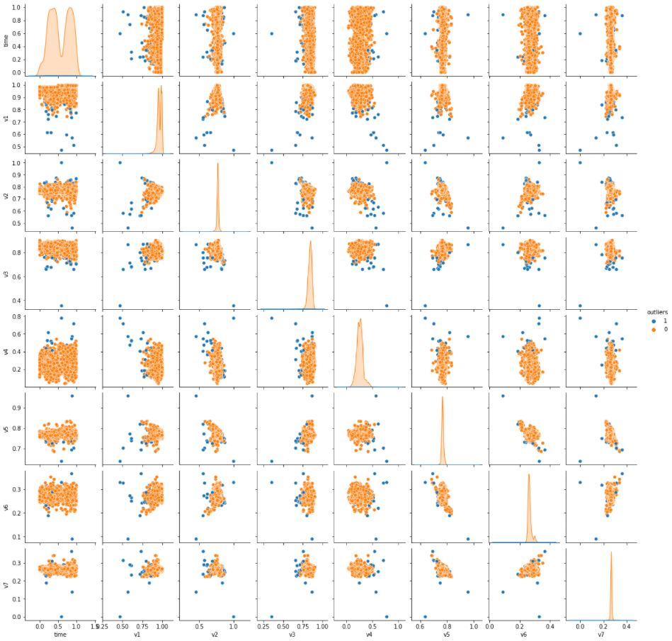

## Сравнение моделей
```python
# Объединение полученных результатов предсказаний по выбросам
outliers = np.vstack([sigma_outliers, quantile_outliers, dbscan_outliers, svm_outliers, forest_outliers])
titles = ['Правило 3-х сигм', 'Межквартильное отклонение', 'Метод DBSCAN', 'Метод One-Class SVM', 'Метод Isolation Forest']

# Сравнение качества моделей по доле выявленных выбросов
outliers_df = pd.DataFrame(np.round(np.hstack([Y_samples.mean(), outliers.mean(axis=1)])[:, None]*100, 2),
                           columns=['Процент'], index=['По выборке', *titles])
outliers_df
```
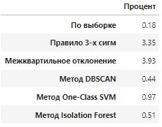

```python
# Определение размера диаграммы
fig, axes = plt.subplots(1, 5, figsize=(19, 3))

# Вывод матриц ошибок для ранее построенных моделей
for i in range(len(outliers)):
    sns.heatmap(confusion_matrix(Y_samples, outliers[i]), fmt='.0f', 
                xticklabels=['Не выброс', 'Выброс'], yticklabels=['Не выброс', 'Выброс'], 
                ax=axes[i], square=True, cbar=False, annot=True)
    axes[i].set_title(titles[i])
    
# Вывод диаграммы
plt.show()
```
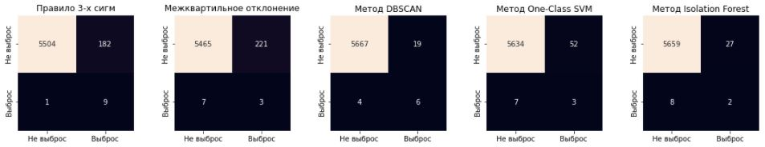

```python
# Определение переменных
scores = []

# Расчет оценок качества и охвата выбросов моделями
for i in range(len(outliers)):
    scores.append([precision_score(Y_samples, outliers[i]), recall_score(Y_samples, outliers[i]), 
                   f1_score(Y_samples, outliers[i]), roc_auc_score(Y_samples, outliers[i])])

# Вывод точности и охвата прогнозирования моделями выбросов
scores_df = pd.DataFrame(np.array(scores).round(2), 
                         columns=['precision', 'recall', 'f1-score', 'auc-roc'], 
                         index=titles)

# Вывод таблицы оценок моделей
print('Таблица оценок точности и охвата определения выбросов в данных')
scores_df
```
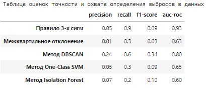

```python
# Добавление исходных данных к визуализации выбросов моделей
outliers = np.vstack([Y_samples, outliers])
titles = ['Исходные данные', *titles]

# Уменьшение размерности признакового пространства методами PCA, TSNE и UMAP
tsne_model = TSNE(n_components=2, random_state=42).fit_transform(X_samples)
umap_model = UMAP(n_components=2, random_state=42).fit_transform(X_samples)

# Определение основных объектов диаграмм
fig, axes = plt.subplots(2, 6, figsize=(24,8))

# Визуализация выбросов моделей
for i in range(len(outliers)):
    sns.scatterplot(x=tsne_model[:, 0], y=tsne_model[:, 1], ax=axes[0, i], hue=outliers[i])
    sns.scatterplot(x=umap_model[:, 0], y=umap_model[:, 1], ax=axes[1, i], hue=outliers[i])
    axes[0, i].set_title(titles[i] + '\n(метод TSNE)')
    axes[1, i].set_title(titles[i] + '\n(метод UMAP)')

# Увеличение расстояния между диаграммами
plt.subplots_adjust(hspace=0.3)
    
# Вывод диаграмм
plt.show()
```
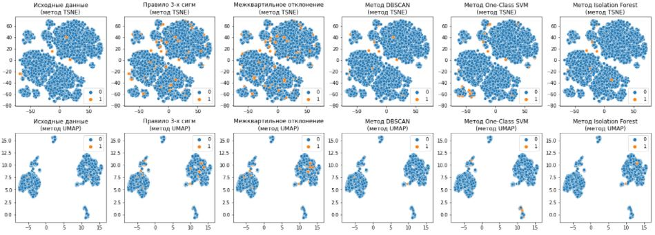
